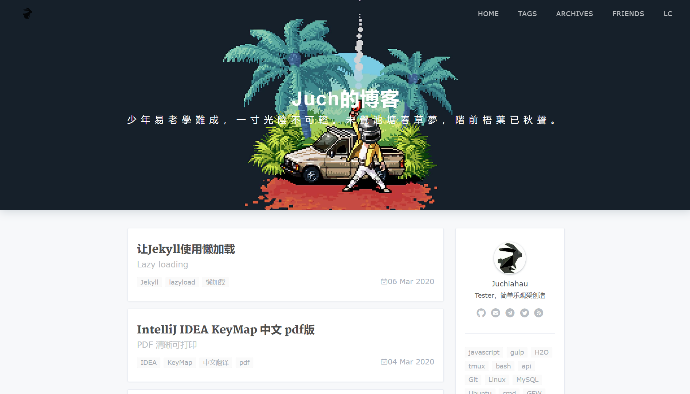
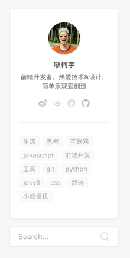
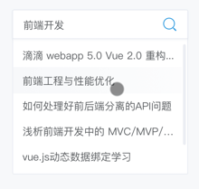
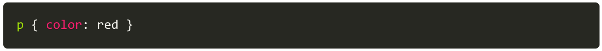
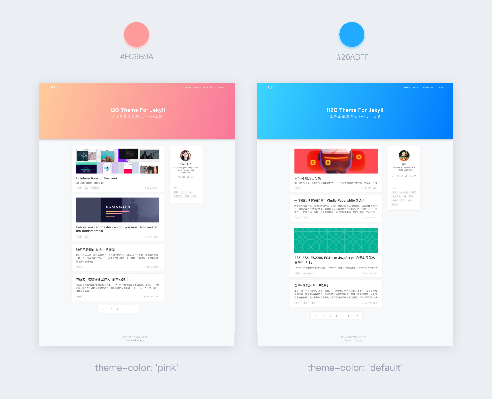
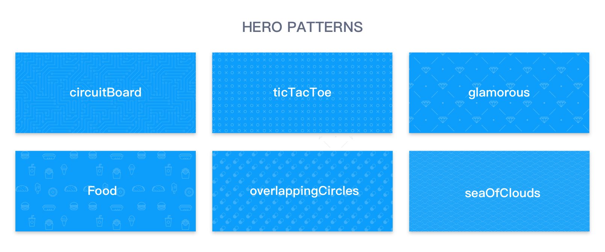
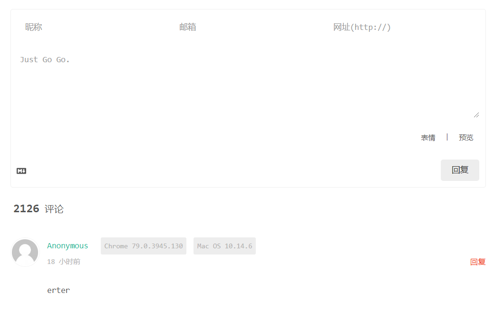

## jekyll-theme-H2O

本项目fork自[jekyll-theme-H2O](https://github.com/kaeyleo/jekyll-theme-H2O) 的 committed ："[19fe6bd](https://github.com/kaeyleo/jekyll-theme-H2O/tree/19fe6bd63cb2eb5fcff446143df65ada47a19874)"

#### [在线预览 Live Demo →](https://blog.juchiahau.com/)



如果你喜欢这个博客模板，请在右上角⭐️star一下，非常感谢～

### Features 特性

- 代码高亮
- 夜间模式
- 文章目录
- Valine评论系统
- 粉蓝两种主题色
- 头图个性化底纹
- 响应式设计
- 社交图标
- SEO标题优化
- 文章标签索引
- 博客文章搜索
- 复制文章内容自动添加版权
- 通过csv直接添加友链

### Usage 快速开始

首先你需要安装Jekyll，请查看文档: [快速指南](http://jekyll.com.cn/docs/quickstart/)

> H2O主题基于Jekyll 3.2.1版本，不同版本之间可能存在部分差异，具体请参考[官方更新文档](https://jekyllrb.com/news/)

点击右上角Fork按钮在你的Github上创建分支，或者`clone`到本地。

```
git clone git@github.com:Ju-ch/ju-ch.github.io.git 
```

最后，在命令行输入 ```bundle exec jekyll server``` 开启服务，就能在本地预览主题了。

如果需要部署到线上环境，请参照配置文档的 **开始** 章节进行操作。

### Document 配置文档

- 开始
	- [站点信息](#站点信息)
	- [写一篇文章](#写一篇文章)
- 组件
	- [导航](#导航)
	- [侧边栏](#侧边栏)
	- [社交图标](#社交图标)
	- [个人简介](#个人简介)
	- [标签](#标签)
	- [文章搜索](#文章搜索)
	- [代码高亮](#代码高亮)
	- [夜间模式](#夜间模式)
- 个性化
	- [博客封面、主题皮肤](#主题皮肤)
	- [头图底纹](#头图底纹)
- 高级部分
	- [自定义](#自定义)
- 集成服务
	- [Valine](#Valine)
	- [Share.js](#sharejs)

You can easily get started by modifying _config.yml

#### 站点信息

你可以通用修改 `_config.yml` 文件来轻松的开始搭建自己的博客

```
# Site settings
title: '廖柯宇的独立博客' # 你的博客网站标题
description: '很高兴能在这里与你分享我对技术和生活的思考。' # 站点描述
keyword: '廖柯宇, 廖柯宇的独立博客, 前端, 设计' # 网站关键词
url: 'http://liaokeyu.com' # 站点url
baseurl: ''
```

其实大部分参数已经默认配置好了，你只需要通过文档了解它们，然后根据自己的需求去`_config.yml`文件里修改即可。

#### 写一篇文章

文章一般都放在`_posts`文件夹里，每篇文章的开头都需要设置一些头信息(不过这在草稿`_drafts`里面已经写好，只需复制一份草稿即可)：

```
---
layout: post
title:  "Welcome to Jekyll!"
subtitle: '或许是最漂亮的Jekyll主题'
date: 2000-02-02 +0800 #编写时间 优先级最高 注意时区 +0800
overwrite: 2000-02-02 +0800 #编辑时间 优先级最高 注意时区 +0800
cover: 'https://image.com'
tags: [test,tag]
author:
    name: Jekyll
    url: "//jekyllrb.com"
postPatterns: #circuitBoard, overlappingCircles, food, glamorous, ticTacToe, seaOfClouds
toc: #boolean
---
```

* 建议文章先在草稿`_drafts`里写好再放到`_post`文件夹下面

> 如何预览草稿箱里的文章？
>```
>bundle exec jekyll serve --drafts
>```
> 运行时加属性`--drafts`或者`-D`都可以

#### 目录

每一篇post的头信息中都应该有`toc: #boolean`这一项，如果你希望这篇文章有目录则`toc`应该为`true`，否则为`false`

 属性 | 参数 | 描述
-----|-----|-------
toc | `true` | 开启当前文章目录
toc | `false` | 关闭当前文章目录

#### 导航

博客顶部的导航栏信息需要以下面的格式进行配置：

```
# Navigation links
nav:
  home: '/'
  tags: '/tags.html'
  archives: '/archives.html'
  lc: '/leave_comments.html'
```

导航链接需要写上完整的html文件名，它们都是放于根目录下的，如果自建文件夹，请务必在`exclude` 参数中增加自建文件夹的文件名:

```
# Build settings
exclude: ['node_modules', 'dev', 'package.json', '自定义的文件夹名字']
```

这样做是为了在Jekyll运行时排除某些文件被复制到运行文件`_site`里去。

#### 侧边栏



侧边栏分为两个部分：【个人简介】和【推荐标签】。当屏幕宽度小于960px时，侧边栏会被隐藏。

#### 社交图标

使用阿里的图标管理平台Iconfont整理了一套常用的社交图标用于博客的个人简介上，并且对鼠标悬停时的样式颜色进行了优化。

配置格式如下：

```
# SNS settings 配置社交网站url
sns:
  email: 'mailto:support@juchiahau.com?subject=Hallo Juch'
  telegram: '//t.me/Juchiahau'
  github: '//github.com/ju-ch'
  rss: '/feed.xml'
```

sns属性可选参数：

社交网站 | 参数
--------|----
推特 | `twitter`
Github | `github`
Medium | `medium`
v2ex | `v2ex`
telegram | `telegram`
email | `email`
google+ | `google`

* sns的图标全部在[iconfont](https://www.iconfont.cn)里面，相关的图标配置则在[share.scss](dev/sass/share.scss)里，有需要的童鞋可以在iconfont里制作自己的项目然后改一下[**share.scss**](dev/sass/share.scss)文件即可。

#### 个人简介

首页侧边栏和文章页面底部都会显示你的个人简介

```
# Author 配置博主信息
author: 'Jack'
nickname: 'xx'
bio: '程序员'
avatar: 'assets/img/avatar.jpg'
```

#### 标签

对侧边栏的标签模块进行相应配置：

```
# Tags
recommend-tags: true
recommend-condition-size: 12

```

Tags配置说明：

 属性 | 参数 | 描述
-----|-----|-------
`recommend-tags` | `true`, `false` | 是否显示推荐标签
`recommend-condition-size` | `12` 或其他数字 | 推荐标签个数限制

#### 文章搜索



基于Jekyll服务器生成文章索引文件 `search.json` 为博客提供搜索服务。输入文章标题或与文章标签相关的关键字即可。

搜索功能默认是开启的，以卡片的样式显示在侧边栏底部。如需关闭请将配置文件 `_config.yml` 中 `search ` 属性的值改为 `false` 。

```
# Search
search: true
```

说明 | 参数
----|-----
开启搜索功能 | `true`
关闭搜索功能 | `false`

#### 代码高亮

模板引入了[Prism.js](http://prismjs.com)，一款轻量、可扩展的代码语法高亮库。

很多知名网站如[MDN](https://developer.mozilla.org/)、[css-tricks](https://css-tricks.com/)也在用它，就连 JavaScript 之父 [Brendan Eich](https://brendaneich.com/) 也在个人博客上使用。



遵循 [HTML5](https://www.w3.org/TR/html5/grouping-content.html#the-pre-element) 标准，Prism 使用语义化的 `<pre>` 元素和 `<code>` 元素来标记代码区块：

```
<pre><code class="language-css">p { color: red }</code></pre>
```

在Markdown中你可以这样写：

	``` css
	p { color: red }
	```

支持的语言列表：<https://prismjs.com/download.html#themes=prism>

#### 夜间模式

晚18点至次日凌晨6点自动开启夜间模式。如果不需要，则将配置文件 `_config.yml` 中 `nightMode ` 属性的值改为 `false` 即可。

```
# Night mode
nightMode: true
```

#### 主题皮肤



支持两种主题颜色蓝色（默认）和粉色

主要效果体现在首页博客封面、顶部导航栏的logo以及鼠标悬停时文字显示的颜色效果。

```
# theme color
theme-color: 'default' # pink or default
```

如果你希望在博客封面显示图片，需要去index.html文件中的头信息中添加 `header-img` 配置：

```
---
layout: default
home-title: Steven的博客
description: 开发者，创造者
header-img: assets/img/banner.jpg
---
```

#### 头图底纹

)

在没有图片的情况下单纯显示颜色会不会太无趣了点？于是想到了加入底纹元素，底纹素材是SVG格式的（保存在css样式里），加载比图片快很多。六种底纹（电路、食物、云海、钻石等等）供你选择，配置如下：

```
# Hero background patterns
postPatterns: 'circuitBoard'
```

`postPatterns` 属性参数配置：

底纹描述  |  参数
------|------
电路 | `circuitBoard`
圆环 | `overlappingCircles`
吃货日常：啃打鸡 | `food`
土豪必备：钻石| `glamorous`
圈圈叉叉 | `ticTacToe`
中国风：云海 | `seaOfClouds`

其中post的头信息中也可以自定义底纹，详见[草稿](_drafts/a-draft-post.md)

#### 自定义

主题开发使用的技术栈也比较简单：引入jQuery类库、使用Sass代替CSS编写样式，使用Gulp完成Sass的编译、CSS和JavaScript的代码合并压缩等任务。

如果你喜欢折腾，想对模板的代码进行修改，需要使用命令 `npm install` 安装 `package.json` 中的依赖，然后 `gulp` 一下即可开始你的自定义之旅。

`package.json`已经配置好，国内的用户可以在安装好**cnmp**之后直接使用`cnmp install --save-dev`进行安装。

在了解H2O主题的目录结构之前，确保你对[Jekyll目录结构](http://jekyll.com.cn/docs/structure/)有所了解。

``` bash
	.
	├── assets		#存放静态资源
	│   ├── css		#所有css文件
	│   ├── fonts	#所有字体文件
	│   ├── img		#所有图片
	│   └── js		#所有js文件
	├── _config.yml		#配置文件
	├── _data	#存放数据文件
	├── dev		#所有开发文件，编译后导出到 asstes
	├── _drafts		#草稿箱
	├── favicon.ico		#网页图标
	├── feed.xml		#rss订阅
	├── gulpfile.js		#自动化任务脚本，编译dev文件夹内容
	├── _includes		#可重用页面组件
	│   ├── footer.html		#页脚说明
	│   ├── header.html		#顶栏
	│   ├── head.html		#html中的<head>标签
	│   └── pageNav.html	#文章列表分页组件		
	├── index.html		#首页
	├── _layouts	#布局模板
	│   ├── default.html	#默认模板
	│   └── post.html		#文章模板
	├── package.json	#npm
	├── _posts		#这里放文章
	│   └── 2017-04-18-hello-jekyll.md		#命名格式
	└── sitemap.xml		#站点地图
```

值得注意的是，css及js的源码都在 `dev` 文件夹中，每一次保存 gulp 都会对它们进行处理并保存到 `assets` 文件夹以供 `_site` 上线环境使用。

#### [Valine](https://valine.js.org)

[Valine](https://valine.js.org)是一个第三方社交评论插件，体验相当不错。



在配置文件 `_config.yml` 中找到comments的相关配置，设置 `valine` 参数为 `true` 打开评论功能（ `false` 为关闭）。

```
# Comments 评论功能
comments:
  valine: true
  app_id: '2G2gXjdf7IhyK7TbADeoxnXq-gzGzoHsz'
  app_key: 'csLlYRnz2l4OsWcfr8VyjRqd'
  placeholder: "输入评论…"
  avatar: 'identicon'
```
描述 | 参数
--- | ---
app_id | `从LeanCloud的应用中得到的appId`
app_key | `从LeanCloud的应用中得到的APP Key`
placeholder | `评论框占位提示符`
avatar | [Gravatar 头像展示方式](https://valine.js.org/avatar.html)

#### Share.js

为了让文章更方便地分享，使用了第三方分享插件[Share.js](https://github.com/overtrue/share.js)，支持一键分享到微博、QQ空间、QQ好友、微信、腾讯微博、豆瓣、Facebook、Twitter、Linkedin、reddit等社交网站。

```
# Share
social-share: true # 开启或者关闭分享功能
```

### Contribution 贡献

Any types of contribution are welcome. Thanks.

接受各种形式的贡献，包括不限于提交问题与需求，修复代码。等待您的 `Pull Request`

#### 感谢参与代码贡献的伙伴

- [Ray-Eldath](https://github.com/Ray-Eldath)
- [sctop](https://github.com/sctop)
- [bananaappletw](https://github.com/bananaappletw)
- [moycat](https://github.com/moycat)

### License 许可证

Jekyll-Theme-H2O is licensed under [MIT](https://github.com/kaeyleo/jekyll-theme-H2O/blob/master/LICENSE).
